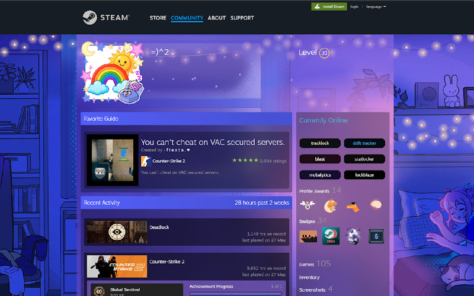
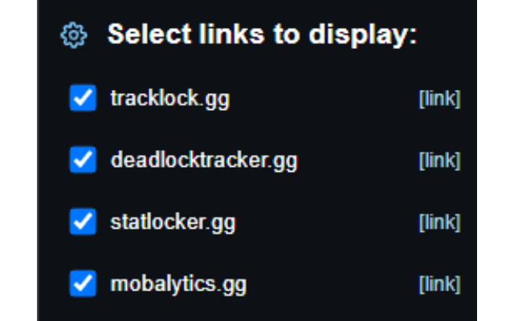

# Deadlock Stats Links

Extension adds Deadlock stats buttons to Steam profiles, linking directly to external Deadlock stats sites for the selected Steam user.

## Features

- Add Deadlock stats links directly to Steam profile pages
- Open supported stats sites for the current Steam user
- Configure which links are shown from the extension popup
- Lightweight Steam profile integration

## Supported Pages

- `https://steamcommunity.com/id/*`
- `https://steamcommunity.com/profiles/*`

## Privacy

- Settings are stored locally in the browser
- The extension does not collect or send personal data to external servers

## Installation

- [Chrome Web Store](https://chromewebstore.google.com/detail/doikcgcigaogkfgjjhaafbnodmabeomd?utm_source=item-share-cbs)
- [Firefox Add-ons](https://addons.mozilla.org/firefox/addon/deadlock-stats-links/)

## Screenshots

**1. Deadlock stats buttons on a Steam profile**

**2. Link visibility controls in the popup**

## Contributing

Feel free to open issues or submit pull requests to improve the extension.
